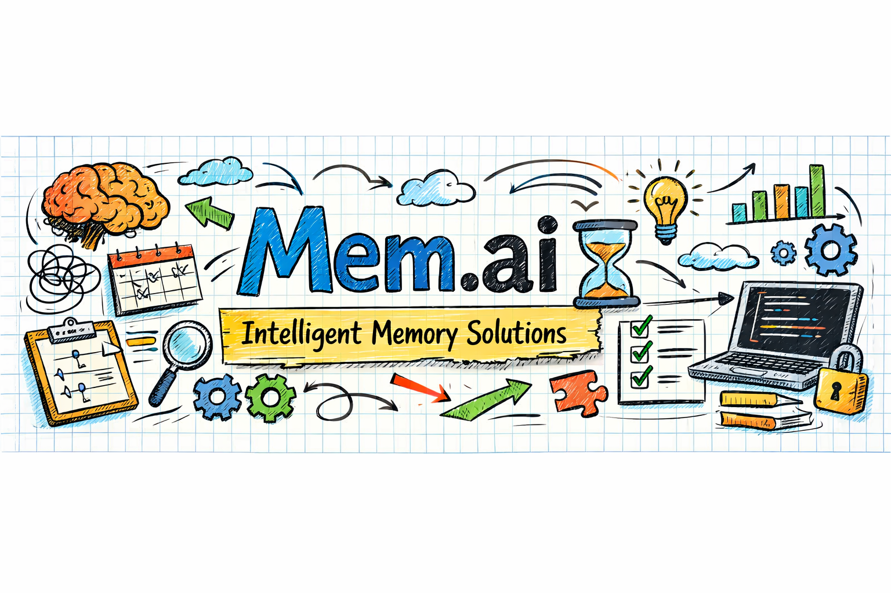

<div align="center">
  
  <h1>🧠 mem.ai</h1>
  <p><strong>The memory layer your agents deserve.</strong></p>
  <p><strong><a href="https://memai.vercel.app/">🌐 Official Website & Documentation</a></strong></p>
  
  <p>
    <a href="https://github.com/SakuDaku05/mem.ai/actions"></a>
    <a href="https://python.org"></a>
    <a href="https://github.com/SakuDaku05/mem.ai/blob/master/LICENSE"></a>
    <a href="https://github.com/SakuDaku05/mem.ai/releases"></a>
  </p>
</div>

---

**mem.ai** is a production-ready, unified memory framework for AI agents. It solves the LLM "lost-in-the-middle" problem by dynamically injecting semantic facts, causal event chains, and procedural workflows exactly where the model pays attention most.

## 🚀 Quick Start (1 Minute)

### 1. Install & Start Server
Install the framework and start the standalone memory engine:
```bash
pip install "memai[all]"
memai serve
```
*(The server auto-generates a secure `.master_key` in the local `memai_data` directory)*

### 2. Connect Your Agent (Python SDK)
Drop the client into your code to seamlessly store facts and retrieve PAMI-optimized context.

```python
from memai.sdk import MemaiClient

# Connect to the local memory engine
with open("memai_data/.master_key") as f:
    client = MemaiClient(base_url="http://localhost:8000", api_key=f.read().strip())

# Store long-term knowledge
client.add("User is allergic to peanuts.", agent_id="support_bot")

# Automatically retrieve the most relevant context for the LLM
context = client.inject("Can you recommend a snack?", agent_id="support_bot")
print(context) 
```

---

## ⚡ Key Features

* 📚 **Semantic Memory:** Dense vector retrieval for facts and preferences powered by embedded ChromaDB.
* 🕸️ **Causal Event Graph:** True temporal reasoning and event tracking powered by Kuzu.
* 🎯 **PAMI Injection:** Position-Aware Memory Injection forces high-utility memories to the outer boundaries of the context window, maximizing LLM recall.
* 🧹 **Auto-Pruning (R1-R4):** Built-in staleness detection automatically decays older memories and prunes direct contradictions.
* 🔐 **Multi-Tenant Isolation:** Complete memory sandboxing using unique `agent_id` prefixes.

---

## 🔌 Framework Connectors

Don't want to manage memory manually? `memai` intercepts your agentic workflow and injects context automatically through native drop-in connectors:

### OpenAI Wrapper
```python
from openai import OpenAI
from memai.connectors.openai import wrap_openai

client = wrap_openai(OpenAI(), api_key="sk-...", base_url="http://localhost:8000")
# Acts exactly like the normal OpenAI client, but with infinite memory!
client.chat.completions.create(..., user="agent-123")
```

### AutoGen
```python
from memai.connectors.autogen import MemaiConversableAgent
agent = MemaiConversableAgent(name="CoderBot", memai_api_key="sk-...", agent_id="bot1")
```

### LangChain
```python
from memai.connectors.langchain import MemaiMemory
memory = MemaiMemory(api_key="sk-...", agent_id="lc-agent")
```

### Claude Code (MCP)
Add `memai` directly into `~/.config/claude/mcp_servers.json` as a Model Context Protocol stdio server.

---

## 🐳 Production Deployment

Deploying `memai` to AWS, DigitalOcean, or your homelab is a single command. The Docker configuration manages C++ build tools, database volumes, and exposed ports automatically.

1. Hardcode your API key in `docker-compose.yml`:
   ```yaml
   environment:
     - MEMAI_API_KEY=sk-prod-super-secret-key...
   ```
2. Start the container:
   ```bash
   docker-compose up -d --build
   ```

---

## 📈 Benchmarks

`memai` is engineered against the strict standards of the **BEAM (ICLR 2026) benchmark**. It consistently outperforms the standard LIGHT baseline in:
* Information Extraction
* Event Ordering
* Conflict Resolution
* Long-Range Dependency 

*(See `BENCHMARK_RESULTS.md` for full test suites and multi-turn fidelity analytics).*

---

## 🛠️ Contributing

We welcome pull requests! Please ensure you run the 135-test integration suite before submitting:
```bash
pytest tests/ -v
```

<div align="center">
  <i>Built with ❤️ by SakuDaku05</i>
</div>
